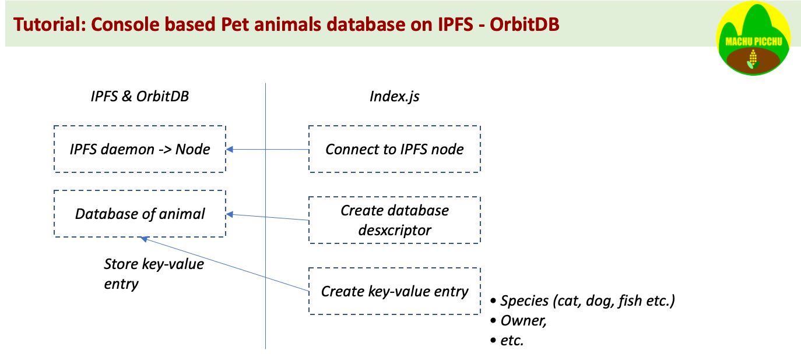

# Console based IPFS and OrbitDB example
## In this example we'll create, populate, read a decentralized key-value database
[](https://opensource.org/licenses/MIT)
[](https://github.com/Machu-Pichu/general.git)
[](https://github.com/Machu-Pichu/general.git)

*(Written in July 2021)*

This project is the simplest possible example of a decentralised database using IPFS + OrbitDB, usable from the console shell interface. A kind of "_Hello World_". 



The next tutorial will add a blockchain backend and a React frontend interface to record the credentials of the entry. Doing so, we separate the immutable part --the credentials of the owner of the data-- from the mutable data itself. This is the basis principle of **Machu Picchu**, a collaborative open source initiative to improve the action of the humanitarians to assist the persons-in-need, by giving back the onwership of data to each person-in-need.

It is part of a series of tutorial articles intended to convince you, IT people working for humanitarians, that blockchain and decentralised programming is not so daunting and can lower your operating costs while bringing a lot of benefits. Join us in project *[Machu Picchu](https://kvutien-yes.medium.com/machu-picchu-how-the-blockchain-can-help-persons-in-need-8396820d13d1)*.

* shared low cost operations
* resilience to failures
* preservation of digital rights of the recipients who keep ownership of data
* easy collection of feedback from recipients
* coordination among all actors

To use this demo, simply follow the setup instructions below. To reproduce the coding yourself, follow the [coding tutorial](TUTO-1.md) (in progress).

## Setup
The setup instructions use the console utility (`Terminal.app`) from MacOS. The setup instructions are the same if you use Linux Ubuntu. 

Under Windows, it is strongly recommended to run a [VirtualBox](https://www.virtualbox.org/wiki/Downloads) for Windows and install a Ubuntu Virtual Machine inside it. Here is a YouTube video of 4 minutes, that can guide you through this double installation process: https://youtu.be/8mns5yqMfZk.
### Overall environment setup, using MacOS
This setup complements your configuration and serves many purposes, not only this "_HelloWorld_" demo.
* Install [Brew](https://brew.sh/)
* Install nodeJS via brew: `brew install node@14.17.0`  (this version of nodeJS is the last long term stable support)

### Setup this specific application, using MacOS
* Clone this repository
``` bash
$ git clone https://github.com/kvutien/orbitdb-tuto-sh.git
    Cloning into 'orbitdb-tuto-sh'...
    remote: Enumerating objects: 35, done.
    remote: Counting objects: 100% (35/35), done.
    remote: Compressing objects: 100% (31/31), done.
    remote: Total 35 (delta 4), reused 35 (delta 4), pack-reused 0
    Receiving objects: 100% (35/35), 770.87 KiB | 4.21 MiB/s, done.
    Resolving deltas: 100% (4/4), done.
$ cd orbitdb-tuto-sh
```
* install the dependencies
``` bash
$ npm install
    ...
    found 566 vulnerabilities (1 low, 565 high)
    run `npm audit fix` to fix them, or `npm audit` for details
$
```
* disregard the warnings. Run the demo by typing
``` bash
$ ipfs daemon --enable-pubsub-experiment & node index.js
```
* your console will display
```
-> IPFS node created
-> OrbitDB instance connected
-> One pet animal created
 -> database value of "species" =  German Shepherd
 -> database value of "owner" =  myself
 ```

## What's next?
This _"Hello World"_ tutorial will be followed by another **Full Stack** tutorial that integrates the blockchain and frontend parts. It will share the core code with this tutorial. In addition, it will also guide you to put your dApp in production on a public web hosting service like Netlify.

To be complete, you have a [tutorial here](./TUTO-1.md) to guide you through the pieces of code and get acquainted to blockchain programming and IPFS. 

It is becoming easy to be a production Full Stack blockchain + IPFS programmer. Stay tuned.